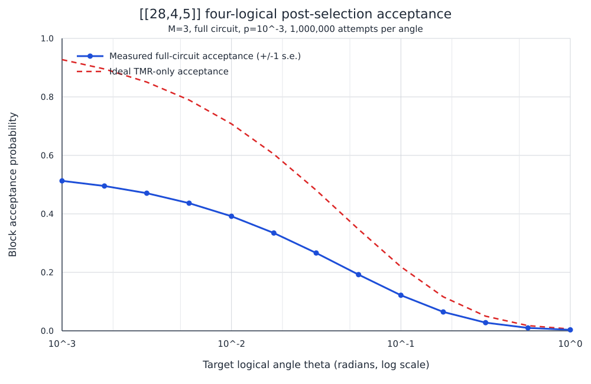

# `[[28,4,5]]` bicycle-chain Ising reference

This document fixes one complete physical presentation of the literal
`ell=2`, `m=7` bicycle-chain code from Ismail et al., its four disjoint
logical resource-state supports, exact ZX self-duality, optimal-depth paper
syndrome schedule, circuit fault-distance certificate, and initial TMR
post-selection results. All indices are zero based; `i` is modulo 2 and `j`
is modulo 7.

The paper labels this family `[[14 ell,2 ell,6]]`. For `ell=2`, however,
exact enumeration and `qldpc` independently give `[[28,4,5]]`. Everything
below refers to the literal polynomial specialization and records the
verified distance five.

## Source identity and certified parameters

- Code family: self-dual bivariate bicycle, called the bicycle-chain family
  in the STAR paper.
- Polynomial instance: `ell=2`, `m=7`.
- Verified parameters: `[[28,4,5]]`, with exact `d_X=d_Z=5`.
- Frozen matrix archive SHA-256:
  `8c5efff89b55d877501e7f60629b797e745197f8626c5041d0aad09bbb4c26b4`.
- Schedule SHA-256:
  `bf8a53fcf43234cb4a8a7aef2000085fd21c0b50cb9219209fc20326f7f253cd`.
- Displayed checks: 14 X checks and 14 Z checks, rank 12 per type.
- Stabilizer weight: every displayed X and Z check has weight 8.
- Data degree: every data qubit belongs to four X and four Z checks.
- Redundancy: two independent displayed-check relations per check type.
- Saved logical basis: four mutually disjoint, weight-seven X/Z fibres.
- Selected syndrome schedule: 224 CNOTs in eight simultaneous layers, using
  14 X ancillas and 14 Z ancillas.
- Certified circuit fault distance: `d_fault=5` in both logical bases for the
  guarded bulk round and the three- and five-round full-noise memories.

The frozen matrices and logical basis are in `code_data/presentation.npz`;
their human-readable export is `code_data/presentation.json`. The exact
schedule is `schedule/paper_table_ii_schedule.json`.

## Polynomial definition

Work over

\[
R=\frac{\mathbb F_2[x,y]}{(x^2-1,y^7-1)}.
\]

The paper polynomial and its involution are

\[
\begin{aligned}
a(x,y)&=1+y^3+xy^2+xy^4,\\
b(x,y)=a^\dagger(x,y)&=1+y^4+xy^3+xy^5,
\end{aligned}
\]

where the dagger sends `x` to `x^{-1}` and `y` to `y^{-1}`. If `A` and `B`
are the corresponding binary block-circulant matrices, then

\[
H_X=[A\mid B],\qquad H_Z=[B^T\mid A^T].
\]

Because `B=A^T`,

\[
\boxed{H_X=H_Z}.
\]

Thus the physical identity is already a ZX fold: transversal physical
Hadamard exchanges the two stabilizer spaces without an additional physical
permutation.

## Physical data-qubit labels

There are two physical halves, `L` and `R`. Their torus coordinates flatten
as

\[
L_{i,j}=q_{7i+j},\qquad R_{i,j}=q_{14+7i+j}.
\]

| `j` | `L_(0,j)` | `L_(1,j)` | `R_(0,j)` | `R_(1,j)` |
|---:|---:|---:|---:|---:|
| `0` | `q0` | `q7` | `q14` | `q21` |
| `1` | `q1` | `q8` | `q15` | `q22` |
| `2` | `q2` | `q9` | `q16` | `q23` |
| `3` | `q3` | `q10` | `q17` | `q24` |
| `4` | `q4` | `q11` | `q18` | `q25` |
| `5` | `q5` | `q12` | `q19` | `q26` |
| `6` | `q6` | `q13` | `q20` | `q27` |

For flattened check index `c=7i+j`, the displayed X and Z stabilizers are
identical and have support

\[
\begin{aligned}
S_{i,j}={}&\{L_{i,j},L_{i,j+3},L_{i+1,j+2},L_{i+1,j+4},\\
&\qquad R_{i,j},R_{i,j+4},R_{i+1,j+3},R_{i+1,j+5}\}.
\end{aligned}
\]

These formulas reconstruct every entry of `H_X` and `H_Z`. For either check
type, the product of checks `0,...,6` is the identity and the product of
checks `7,...,13` is the identity. Those are the two independent displayed
row relations.

## Logical X and Z representatives

For a support `S`, define

\[
X(S)=\prod_{r\in S}X_{q_r},\qquad
Z(S)=\prod_{r\in S}Z_{q_r}.
\]

The saved canonical representatives are:

| Logical | Z support | X support |
|---:|---|---|
| `0` | `{q0,q1,q2,q3,q4,q5,q6}` | `{q0,q1,q2,q3,q4,q5,q6}` |
| `1` | `{q7,q8,q9,q10,q11,q12,q13}` | `{q7,q8,q9,q10,q11,q12,q13}` |
| `2` | `{q14,q15,q16,q17,q18,q19,q20}` | `{q14,q15,q16,q17,q18,q19,q20}` |
| `3` | `{q21,q22,q23,q24,q25,q26,q27}` | `{q21,q22,q23,q24,q25,q26,q27}` |

Every representative has odd weight seven, the four supports are mutually
disjoint, and

\[
\bar Z_r\bar X_s=(-1)^{\delta_{rs}}\bar X_s\bar Z_r.
\]

Consequently all four logical Z rotations can be synthesized in one parallel
batch,

\[
\mathcal B_Z=\{0,1,2,3\}.
\]

These weight-seven fibres are convenient representatives, but they are not
minimum-weight logicals. One saved minimum logical witness is supported on

\[
\{q_2,q_9,q_{14},q_{16},q_{17}\},
\]

and exhaustive enumeration establishes `d_X=d_Z=5`.

## ZX duality, translations, and logical Clifford actions

Since `H_X=H_Z` and the chosen X and Z logical representatives are identical,
transversal Hadamard acts exactly as

\[
H^{\otimes28}:\quad
\bar X_r\longleftrightarrow\bar Z_r,
\qquad r=0,1,2,3.
\]

There is no hidden logical mixing or swap in this basis.

The physical `x` translation is

\[
T_x:L_{i,j}\mapsto L_{i+1,j},\qquad
R_{i,j}\mapsto R_{i+1,j}.
\]

In physical cycle notation it is

\[
\begin{aligned}
T_x={}&(q_0\ q_7)(q_1\ q_8)(q_2\ q_9)(q_3\ q_{10})
(q_4\ q_{11})(q_5\ q_{12})(q_6\ q_{13})\\
&\quad(q_{14}\ q_{21})(q_{15}\ q_{22})(q_{16}\ q_{23})
(q_{17}\ q_{24})(q_{18}\ q_{25})(q_{19}\ q_{26})(q_{20}\ q_{27}).
\end{aligned}
\]

It preserves the stabilizer code and acts logically as

\[
T_x=(0\ 1)(2\ 3).
\]

The CSS construction also supplies physical pairwise transversal CNOT
between two identically labeled code blocks. Because the displayed X checks
have weight eight and the code is self-dual, the standard global phase-gate
Clifford is also available; conjugating it by the transversal Hadamard gives
the corresponding global `sqrt(X)` Clifford used in STAR constructions.

## Optimal simultaneous syndrome schedule

Let `x_(i,j)` and `z_(i,j)` denote the X- and Z-check ancillas for check
`c=7i+j`. Prepare each X ancilla in `|+>` and each Z ancilla in `|0>`. At
each row below, apply the displayed operation simultaneously for every
`i in Z_2` and `j in Z_7`.

| Layer | Paper round | X-check CNOT | Z-check CNOT |
|---:|---:|---|---|
| `0` | `1` | `x_(i,j) -> L_(i+1,j+4)` | `R_(i,j) -> z_(i,j)` |
| `1` | `2` | `x_(i,j) -> R_(i+1,j+3)` | `L_(i,j) -> z_(i,j)` |
| `2` | `3` | `x_(i,j) -> L_(i+1,j+2)` | `R_(i,j+4) -> z_(i,j)` |
| `3` | `4` | `x_(i,j) -> R_(i+1,j+5)` | `L_(i+1,j+2) -> z_(i,j)` |
| `4` | `5` | `x_(i,j) -> R_(i,j+4)` | `L_(i,j+3) -> z_(i,j)` |
| `5` | `6` | `x_(i,j) -> L_(i,j+3)` | `R_(i+1,j+5) -> z_(i,j)` |
| `6` | `7` | `x_(i,j) -> R_(i,j)` | `L_(i+1,j+4) -> z_(i,j)` |
| `7` | `8` | `x_(i,j) -> L_(i,j)` | `R_(i+1,j+3) -> z_(i,j)` |

After layer 7, measure all X ancillas in the X basis and all Z ancillas in
the Z basis. Every layer contains 28 CNOTs and is a perfect matching on all
28 data qubits and all 28 ancillas. The complete round therefore contains
224 CNOTs at depth eight.

Every data qubit has combined X/Z Tanner degree eight, so no collision-free
one-ancilla-per-check schedule can have depth below eight. The paper schedule
meets that lower bound and is depth optimal. Symbolic Pauli propagation also
verifies that its cross-ancilla backaction parities cancel.

## Circuit fault distance

The exact result for the Table-II schedule is

\[
\boxed{d_{\mathrm{fault}}=5}.
\]

This holds in both X and Z logical bases for:

- a noisy CNOT-only extraction round bracketed by ideal guard rounds;
- a three-round full-noise memory experiment;
- a five-round full-noise memory experiment.

The full model includes noisy data and ancilla preparation, CNOTs,
measurements, and entangling-layer idles. Exact meet-in-the-middle
enumeration excludes every undetected logical mechanism containing one to
four elementary faults. Five final-data measurement faults on a saved
weight-five logical give the matching upper bound; Stim also finds explicit
five-fault witnesses in the guarded bulk circuit.

The five-round circuits use 56 total qubits, 160 detectors, and four logical
observables. Their exact four-fault tables contain about 28.9 million
X-basis pairs and 28.5 million Z-basis pairs. Since the static distance is
five, no syndrome ordering can exceed this fault distance for the tested
memory experiment.

## `M=3` TMR decomposition

The four weight-seven logical-Z fibres are partitioned as follows:

| Logical | Piece 0 | Piece 1 | Piece 2 |
|---:|---|---|---|
| `0` | `{q0,q1}` | `{q2,q3}` | `{q4,q5,q6}` |
| `1` | `{q7,q8}` | `{q9,q10}` | `{q11,q12,q13}` |
| `2` | `{q14,q15}` | `{q16,q17}` | `{q18,q19,q20}` |
| `3` | `{q21,q22}` | `{q23,q24}` | `{q25,q26,q27}` |

All 12 pieces are mutually disjoint. Their X-syndrome matrix has rank eight
and kernel dimension four. The kernel is exactly generated by selecting all
three pieces of any one logical; no unintended proper partial product
survives the final projection.

With the deterministic minimum-label pivot choice, the parallel parity
ladders are:

| Stage | Physical operations |
|---|---|
| Forward layer 0 | `CX q1 q0`, `CX q3 q2`, `CX q5 q4`, `CX q8 q7`, `CX q10 q9`, `CX q12 q11`, `CX q15 q14`, `CX q17 q16`, `CX q19 q18`, `CX q22 q21`, `CX q24 q23`, `CX q26 q25` |
| Forward layer 1 | `CX q6 q4`, `CX q13 q11`, `CX q20 q18`, `CX q27 q25` |
| Rotation layer | simultaneous `R_Z(theta_star)` on `q0,q2,q4,q7,q9,q11,q14,q16,q18,q21,q23,q25` |
| Reverse layer 1 | `CX q6 q4`, `CX q13 q11`, `CX q20 q18`, `CX q27 q25` |
| Reverse layer 0 | `CX q1 q0`, `CX q3 q2`, `CX q5 q4`, `CX q8 q7`, `CX q10 q9`, `CX q12 q11`, `CX q15 q14`, `CX q17 q16`, `CX q19 q18`, `CX q22 q21`, `CX q24 q23`, `CX q26 q25` |

For target logical angle `theta`, the physical angle is

\[
\theta_\star=
2\arctan\!\left(
\operatorname{sgn}\!\left[-\tan(\theta/2)\right]
\left|\tan(\theta/2)\right|^{1/3}
\right).
\]

At `theta=pi/32`,

\[
\theta_\star=-0.7021479831\approx-0.223500645\pi.
\]

## Full post-selection circuit

The experiment deliberately stops before resource-state teleportation:

1. transversally prepare all 28 data qubits in `|+>`;
2. execute one eight-layer Z-only initialization round;
3. apply the measured-syndrome-dependent virtual X-frame correction;
4. execute the four-layer parallel TMR parity ladders around one rotation
   layer;
5. execute one eight-layer simultaneous X/Z syndrome round;
6. accept only when all 14 displayed X and all 14 displayed Z outcomes in
   the final round are trivial.

The full four-logical circuit has:

| Quantity | Value |
|---|---:|
| Data qubits | `28` |
| Dedicated syndrome ancillas | `28` (`14 X + 14 Z`) |
| Maximum simultaneous physical width | `56` |
| CNOT count | `368` |
| Entangling layers | `20` |
| Physical rotations | `12` in one layer |
| Measurements | `42` (`14` initialization + `28` final) |
| Final post-selection outcomes | `28` |
| Initialization-redundancy diagnostics | `2` (not postselected) |

The CNOT accounting is

\[
112\ \text{(Z initialization)}
+32\ \text{(TMR ladders)}
+224\ \text{(final syndrome)}
=368.
\]

At every enabled preparation, measurement, rotation, CNOT, and
entangling-layer idle location, the circuit-level experiment sets the error
probability to the common value `p`. It applies one-qubit depolarizing noise
after preparations, rotations, and idle locations; two-qubit depolarizing
noise after CNOTs; and basis-appropriate flips before measurement.

## Post-selection probability

For

\[
p=10^{-3},\qquad \theta=\frac{\pi}{32},\qquad M=3,\qquad N=4,
\]

the ideal per-logical TMR acceptance is

\[
p_1=0.6871495483,
\]

and the ideal four-logical block acceptance is

\[
p_{\mathrm{ideal}}=p_1^4=0.2229487601.
\]

One million attempts in each mode gave:

| Mode | Acceptance | Standard error | Noise/ideal | Candidate yield `4s` |
|---|---:|---:|---:|---:|
| Ideal projection sampler | `0.221812` | `0.000415` | `0.99490` | `0.887248` |
| Scheduled noisy TMR only | `0.158584` | `0.000365` | `0.71130` | `0.634336` |
| Full circuit | `0.123622` | `0.000329` | `0.55449` | `0.494488` |

The full-circuit run accepted 123,622 of 1,000,000 attempted blocks. Its 95%
Wilson interval is

\[
[0.1229783,0.1242686].
\]

Thus about 12.4%, or roughly one in eight attempts, produces a block in
which all four candidate logical resource states pass post-selection. The
mean number of attempts per accepted four-resource candidate block is

\[
\frac{1}{p_{\mathrm{accept}}}=8.089.
\]

The candidate-resource yield is

\[
4p_{\mathrm{accept}}=0.494488
\]

candidate logical resources per factory attempt. Marginal diagnostic pass
rates were `0.147737` for the final X-syndrome conditions and `0.670611` for
the final Z-syndrome conditions; their joint acceptance was `0.123622`. The
X projection is the dominant rejection channel, largely because it contains
the intended TMR projection.

Acceptance does not certify conditional logical fidelity. No teleportation
or logical-output measurement is included in these results.

### Acceptance as a function of target angle

A full-circuit sweep used the same `N=4`, `M=3`, one-final-check protocol and
`p=10^-3` noise model at 13 logarithmically spaced target angles from 1 to
`10^-3` radians. Every point contains one million attempts.



| Target `theta` (rad) | Measured block acceptance | Standard error | Ideal TMR acceptance | Candidate yield |
|---:|---:|---:|---:|---:|
| `1` | `0.003441` | `0.0000586` | `0.0061162` | `0.013764` |
| `0.562341` | `0.009949` | `0.0000992` | `0.0177798` | `0.039796` |
| `0.316228` | `0.027937` | `0.000165` | `0.0501462` | `0.111748` |
| `0.177828` | `0.064578` | `0.000246` | `0.1162732` | `0.258312` |
| `0.1` | `0.121674` | `0.000327` | `0.2191488` | `0.486696` |
| `0.0562341` | `0.192183` | `0.000394` | `0.3470587` | `0.768732` |
| `0.0316228` | `0.266169` | `0.000442` | `0.4808807` | `1.064676` |
| `0.0177828` | `0.334486` | `0.000472` | `0.6041267` | `1.337944` |
| `0.01` | `0.391746` | `0.000488` | `0.7076880` | `1.566984` |
| `0.00562341` | `0.436532` | `0.000496` | `0.7892501` | `1.746128` |
| `0.00316228` | `0.470671` | `0.000499` | `0.8506455` | `1.882684` |
| `0.00177828` | `0.495279` | `0.000500` | `0.8954350` | `1.981116` |
| `0.001` | `0.512838` | `0.000500` | `0.9274122` | `2.051352` |

Across the sweep, full-circuit acceptance rises from

\[
0.003441\pm0.0000586\quad(\theta=1)
\]

to

\[
0.512838\pm0.000500\quad(\theta=10^{-3}).
\]

Noisy acceptance is approximately 55.3--56.3% of the ideal TMR-only
acceptance throughout the sweep. The intended TMR projection supplies the
angle dependence, while the fixed noisy Clifford circuit contributes an
approximately angle-independent survival factor under this model.

## Literature reference and provenance

The construction and eight-round schedule come from Ismail et al., “Fast and
Parallel High-Rate STAR Architecture for Megaquop Quantum Simulation,”
[arXiv:2606.25011v1](https://arxiv.org/abs/2606.25011), Appendix B, Eq. (B1)
and Table II. This directory evaluates the literal `ell=2`, `m=7`
specialization. The paper's family label predicts distance six, but the
saved exact enumeration finds a weight-five logical and therefore parameters
`[[28,4,5]]`.

## Reproducibility and present limitations

The most important artifacts are:

| Artifact | Purpose |
|---|---|
| `code_data/presentation.npz` | Frozen `H_X`, `H_Z`, logical X, and logical Z arrays |
| `code_data/presentation.json` | Human-readable supports, translations, and validation |
| `schedule/paper_table_ii_schedule.json` | Exact eight-layer schedule |
| `stim_fault_distance/RESULTS.md` | Fault-distance certificate summary |
| `tmr_postselection/partitions_m3.json` | Exact `2+2+3` TMR partition certificate |
| `tmr_postselection/PRIMARY_RUNS.md` | Primary simulation estimates and uncertainty |
| `tmr_postselection/ANGLE_SWEEP_P1E3.csv` | Complete machine-readable angle sweep |
| `tmr_postselection/ANGLE_SWEEP_P1E3.svg` | Angle-sweep plot |

Run all regression tests with:

```bash
PYTHONPATH=/home/judah_unmuth/gala-code-search \
/home/judah_unmuth/Documents/multistaq/star-simulators/.venv-clifft/bin/python \
  -m unittest discover -s bicycle_chain_l2_paper/tests -v
```

Run the exact five-round fault-distance validation with:

```bash
NUMBA_CACHE_DIR=/tmp/numba-cache \
PYTHONPATH=/home/judah_unmuth/gala-code-search \
/home/judah_unmuth/gala-code-search/.venv/bin/python \
  -m bicycle_chain_l2_paper.stim_fault_distance.run_validation \
  --memory-rounds 5 \
  --output bicycle_chain_l2_paper/stim_fault_distance/results/paper_schedule_r5.json
```

Raw simulation JSON and generated Stim circuits are kept in ignored
`results/` directories; compact Markdown, CSV, SVG, schedule, matrix, and
certificate files are version controlled.

This document intentionally stops at post-selection. It makes no claim about
conditional logical infidelity, cross-logical error covariance after
acceptance, teleportation success, RUS behavior, or multi-factory completion
times. Those quantities have not yet been simulated for this code.
