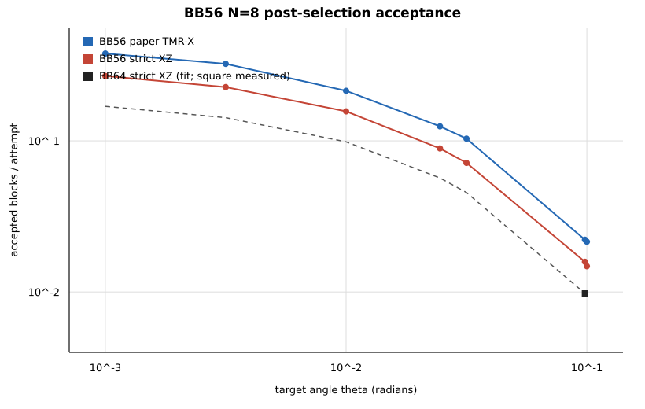

# BB56 post-selection suite

All noisy runs use the frozen `[[56,8,6]]` presentation, the published depth-eight schedule, `M=3`, and `p=10^-3`. This report concerns candidate-state acceptance only; it does not include teleportation or conditional logical infidelity.

## Key findings

- At `theta=10^-3`, `N=8` acceptance is `0.37830` under the paper policy and `0.26870` under strict XZ.
- At `theta=pi/32`, those acceptances fall to `0.02217` and `0.01583`.
- Sixteen independently retried strict-XZ blocks have expected slowest completion `11.30` attempts at `theta=10^-3`, `20.34` at `theta=10^-2`, and `212.32` at `theta=pi/32`.
- The measured noise/ideal ratio is approximately angle-independent within each acceptance convention, validating the factorized acceptance model over this sweep.

## Circuit scaling

| N | physical CNOTs | CNOT layers | physical rotations | ClifT active width |
|---|---|---|---|---|
| 1 | 680 | 20 | 3 | 3 |
| 2 | 688 | 20 | 6 | 6 |
| 4 | 704 | 20 | 12 | 12 |
| 8 | 736 | 20 | 24 | 24 |

## Ideal-projection validation

| theta | N | attempts | measured +/- s.e. | exact | difference/s.e. |
|---|---|---|---|---|---|
| 0.0245437 | 1 | 20000 | 0.8623 +/- 0.00244 | 0.856104 | 2.54304 |
| 0.0245437 | 2 | 20000 | 0.7364 +/- 0.00312 | 0.732914 | 1.11911 |
| 0.0245437 | 4 | 20000 | 0.5333 +/- 0.00353 | 0.537162 | -1.09483 |
| 0.0245437 | 8 | 20000 | 0.2936 +/- 0.00322 | 0.288543 | 1.57031 |
| 0.0981748 | 1 | 20000 | 0.69375 +/- 0.00326 | 0.68715 | 2.02511 |
| 0.0981748 | 2 | 20000 | 0.47775 +/- 0.00353 | 0.472175 | 1.57855 |
| 0.0981748 | 4 | 50000 | 0.22284 +/- 0.00186 | 0.222949 | -0.058439 |
| 0.0981748 | 8 | 100000 | 0.05127 +/- 0.000697 | 0.0497061 | 2.24229 |
| 0.392699 | 1 | 20000 | 0.42865 +/- 0.0035 | 0.431325 | -0.764431 |
| 0.392699 | 2 | 30000 | 0.186567 +/- 0.00225 | 0.186041 | 0.2336 |
| 0.392699 | 4 | 100000 | 0.03443 +/- 0.000577 | 0.0346114 | -0.314531 |
| 0.392699 | 8 | 1000000 | 0.001248 +/- 3.53e-05 | 0.00119795 | 1.41777 |

## N=8 angle sweep

| theta | policy | attempts | acceptance +/- s.e. | ideal | noise/ideal | yield 8s | 1/s | E[max 16] |
|---|---|---|---|---|---|---|---|---|
| 0 | `strict-xz` | 100000 | 0.30701 +/- 0.00146 | 1 | 0.30701 | 2.45608 | 3.25722 | 9.71833 |
| 0 | `tmr-x` | 100000 | 0.43621 +/- 0.00157 | 1 | 0.43621 | 3.48968 | 2.29247 | 6.3993 |
| 0.001 | `strict-xz` | 10000 | 0.2687 +/- 0.00443 | 0.860093 | 0.312408 | 2.1496 | 3.72162 | 11.3034 |
| 0.001 | `tmr-x` | 10000 | 0.3783 +/- 0.00485 | 0.860093 | 0.439836 | 3.0264 | 2.6434 | 7.61287 |
| 0.00316228 | `strict-xz` | 10000 | 0.2268 +/- 0.00419 | 0.723598 | 0.313434 | 1.8144 | 4.40917 | 13.6435 |
| 0.00316228 | `tmr-x` | 10000 | 0.3233 +/- 0.00468 | 0.723598 | 0.446795 | 2.5864 | 3.0931 | 9.15683 |
| 0.01 | `strict-xz` | 10000 | 0.1567 +/- 0.00364 | 0.500822 | 0.312885 | 1.2536 | 6.38162 | 20.3362 |
| 0.01 | `tmr-x` | 10000 | 0.2144 +/- 0.0041 | 0.500822 | 0.428096 | 1.7152 | 4.66418 | 14.51 |
| 0.0245437 | `strict-xz` | 10000 | 0.0891 +/- 0.00285 | 0.288543 | 0.308793 | 0.7128 | 11.2233 | 36.7264 |
| 0.0245437 | `tmr-x` | 10000 | 0.1247 +/- 0.0033 | 0.288543 | 0.432171 | 0.9976 | 8.01925 | 25.883 |
| 0.0316228 | `strict-xz` | 10000 | 0.0715 +/- 0.00258 | 0.231246 | 0.309194 | 0.572 | 13.986 | 46.0717 |
| 0.0316228 | `tmr-x` | 10000 | 0.1034 +/- 0.00304 | 0.231246 | 0.447142 | 0.8272 | 9.67118 | 31.4745 |
| 0.0981748 | `strict-xz` | 30000 | 0.0158333 +/- 0.000721 | 0.0497061 | 0.318539 | 0.126667 | 63.1579 | 212.325 |
| 0.0981748 | `tmr-x` | 30000 | 0.0221667 +/- 0.00085 | 0.0497061 | 0.445954 | 0.177333 | 45.1128 | 151.317 |
| 0.1 | `strict-xz` | 10000 | 0.0148 +/- 0.00121 | 0.0480262 | 0.308165 | 0.1184 | 67.5676 | 227.233 |
| 0.1 | `tmr-x` | 10000 | 0.0215 +/- 0.00145 | 0.0480262 | 0.447672 | 0.172 | 46.5116 | 156.047 |

## Acceptance-policy comparison

The final column estimates the probability that all raw Z checks pass conditional on the paper-matching X projection passing.

| theta | TMR-X | strict XZ | strict/TMR-X |
|---|---|---|---|
| 0 | 0.43621 | 0.30701 | 0.703812 |
| 0.001 | 0.3783 | 0.2687 | 0.710283 |
| 0.00316228 | 0.3233 | 0.2268 | 0.701516 |
| 0.01 | 0.2144 | 0.1567 | 0.730877 |
| 0.0245437 | 0.1247 | 0.0891 | 0.714515 |
| 0.0316228 | 0.1034 | 0.0715 | 0.691489 |
| 0.0981748 | 0.0221667 | 0.0158333 | 0.714286 |
| 0.1 | 0.0215 | 0.0148 | 0.688372 |

## Number of simultaneous logicals

| theta | policy | N | attempts | acceptance +/- s.e. | ideal | yield Ns |
|---|---|---|---|---|---|---|
| 0.01 | `strict-xz` | 1 | 20000 | 0.2728 +/- 0.00315 | 0.917192 | 0.2728 |
| 0.01 | `strict-xz` | 2 | 20000 | 0.24825 +/- 0.00305 | 0.841242 | 0.4965 |
| 0.01 | `strict-xz` | 4 | 20000 | 0.2088 +/- 0.00287 | 0.707688 | 0.8352 |
| 0.01 | `strict-xz` | 8 | 10000 | 0.1567 +/- 0.00364 | 0.500822 | 1.2536 |
| 0.01 | `tmr-x` | 1 | 20000 | 0.3973 +/- 0.00346 | 0.917192 | 0.3973 |
| 0.01 | `tmr-x` | 2 | 20000 | 0.35995 +/- 0.00339 | 0.841242 | 0.7199 |
| 0.01 | `tmr-x` | 4 | 20000 | 0.302 +/- 0.00325 | 0.707688 | 1.208 |
| 0.01 | `tmr-x` | 8 | 10000 | 0.2144 +/- 0.0041 | 0.500822 | 1.7152 |
| 0.0981748 | `strict-xz` | 1 | 20000 | 0.2032 +/- 0.00285 | 0.68715 | 0.2032 |
| 0.0981748 | `strict-xz` | 2 | 20000 | 0.1373 +/- 0.00243 | 0.472175 | 0.2746 |
| 0.0981748 | `strict-xz` | 4 | 20000 | 0.0662 +/- 0.00176 | 0.222949 | 0.2648 |
| 0.0981748 | `strict-xz` | 8 | 30000 | 0.0158333 +/- 0.000721 | 0.0497061 | 0.126667 |
| 0.0981748 | `tmr-x` | 1 | 20000 | 0.2921 +/- 0.00322 | 0.68715 | 0.2921 |
| 0.0981748 | `tmr-x` | 2 | 20000 | 0.2025 +/- 0.00284 | 0.472175 | 0.405 |
| 0.0981748 | `tmr-x` | 4 | 20000 | 0.09445 +/- 0.00207 | 0.222949 | 0.3778 |
| 0.0981748 | `tmr-x` | 8 | 30000 | 0.0221667 +/- 0.00085 | 0.0497061 | 0.177333 |

## Direct BB64 comparison

| code | attempts | strict-XZ acceptance | s.e. | yield 8s | physical CNOTs | CNOT layers |
|---|---|---|---|---|---|---|
| `BB56` | 30000 | 0.0158333 | 0.000720709 | 0.126667 | 736 | 20 |
| `BB64` | 41000 | 0.00978049 | 0.00048602 | 0.0782439 | 848 | 24 |

For context only, the following BB64 values extrapolate its measured `pi/32` noise-survival factor across angle. They are not additional BB64 simulations.

| theta | BB56 strict measured | BB64 strict extrapolated | BB56/BB64 |
|---|---|---|---|
| 0.001 | 0.2687 | 0.169237 | 1.58771 |
| 0.00316228 | 0.2268 | 0.14238 | 1.59293 |
| 0.01 | 0.1567 | 0.0985449 | 1.59014 |
| 0.0245437 | 0.0891 | 0.0567755 | 1.56934 |
| 0.0316228 | 0.0715 | 0.0455014 | 1.57138 |
| 0.0981748 | 0.0158333 | 0.00978049 | 1.61887 |
| 0.1 | 0.0148 | 0.00944993 | 1.56615 |

The `tmr-x` policy is retained to reproduce the paper's fitted acceptance convention. The `strict-xz` policy is the matched comparison with the original BB64 post-selection experiment.

Raw checkpoint JSON files remain ignored; this report, its CSV table, the SVG, manifests, and source are version controlled.
