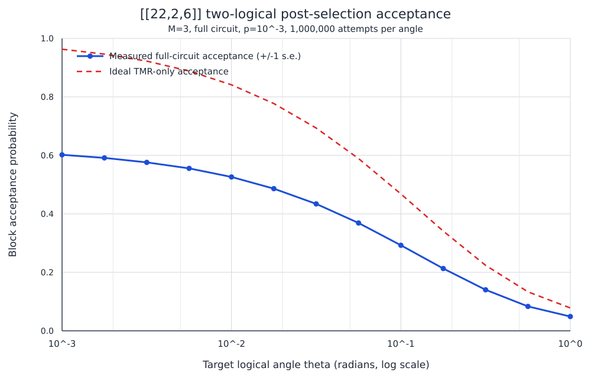

# `[[22,2,6]]` shortened-Golay Ising reference

This document fixes one complete physical presentation of the cyclic
`[[22,2,6]]` CSS code, its two disjoint logical resource-state supports, its
ZX fold, its optimal-depth simultaneous syndrome schedule, and the initial
TMR post-selection result.  All indices are zero based and all cyclic
subscripts below are modulo 11.

## Source identity and certified parameters

- Code family: shortened quantum Golay code in an MCR/generalized-bicycle
  presentation.
- Parameters: `[[22,2,6]]`, with exact `d_X=d_Z=6`.
- Code archive SHA-256:
  `63bd3c293318c7c3166177fd774effe5533b379b7d9d2ac7058251ff70c9f00b`.
- Schedule SHA-256:
  `dc8168ebfcc6e7f63df2cf841a388fbe1fe69f7d0cdf3bdbd499639374f609b4`.
- Displayed checks: 11 X checks and 11 Z checks, rank 10 per type.
- Stabilizer weight: every displayed X and Z check has weight 8.
- Redundancy: the product of all 11 displayed checks of either type is the
  identity.
- Selected schedule: 176 CNOTs in 8 simultaneous layers, using 11 X ancillas
  and 11 Z ancillas.
- Certified circuit fault distance of that schedule: `d_fault=5` in both
  logical bases for the guarded CNOT-only and three-round full-noise memory
  experiments.

The frozen code and schedule records are `code_data/presentation.npz` and
`schedule/baseline_schedule.json` in this directory.

## Polynomial definition

Work over

\[
R=\mathbb F_2[x]/(x^{11}-1).
\]

The defining polynomials are

\[
f=1+x,\qquad p=1,\qquad
q=x+x^3+x^4+x^5+x^9.
\]

Writing

\[
a=pf=1+x,
\]

and

\[
b=qf=x+x^2+x^3+x^6+x^9+x^{10},
\]

the CSS check matrices are

\[
H_X=[\operatorname{circ}(a)\mid\operatorname{circ}(b)],
\qquad
H_Z=[\operatorname{circ}(b)^T\mid\operatorname{circ}(a)^T].
\]

## Physical data-qubit labels

The two cyclic physical halves are

\[
L_i=q_i,\qquad R_i=q_{11+i},\qquad i\in\mathbb Z_{11}.
\]

| Cyclic coordinate | L qubit | R qubit |
|---:|---:|---:|
| `0`  | `q0`  | `q11` |
| `1`  | `q1`  | `q12` |
| `2`  | `q2`  | `q13` |
| `3`  | `q3`  | `q14` |
| `4`  | `q4`  | `q15` |
| `5`  | `q5`  | `q16` |
| `6`  | `q6`  | `q17` |
| `7`  | `q7`  | `q18` |
| `8`  | `q8`  | `q19` |
| `9`  | `q9`  | `q20` |
| `10` | `q10` | `q21` |

For check index `i`, the displayed stabilizers have supports

\[
\begin{aligned}
S_i^X={}&\{L_i,L_{i+1},R_{i+1},R_{i+2},R_{i+3},R_{i+6},R_{i+9},R_{i+10}\},\\
S_i^Z={}&\{L_{i+1},L_{i+2},L_{i+5},L_{i+8},L_{i+9},L_{i+10},R_i,R_{i+10}\}.
\end{aligned}
\]

These formulas reconstruct every entry of `H_X` and `H_Z` directly in the
physical labels above.

## Logical X and Z representatives

For a support `S`, define

\[
X(S)=\prod_{j\in S}X_{q_j},\qquad
Z(S)=\prod_{j\in S}Z_{q_j}.
\]

The saved canonical representatives are:

| Logical | Z support | X support |
|---:|---|---|
| `0` | `{q0,q1,q3,q4,q5,q9,q11}` | `{q0,q1,q3,q4,q5,q9,q11}` |
| `1` | `{q2,q7,q8,q12,q15,q16,q17}` | `{q1,q4,q5,q7,q8,q11,q12}` |

Every displayed logical has weight 7, and

\[
\bar Z_i\bar X_j=(-1)^{\delta_{ij}}\bar X_j\bar Z_i.
\]

The two logical-Z supports are fully disjoint:

\[
\operatorname{supp}(\bar Z_0)\cap
\operatorname{supp}(\bar Z_1)=\varnothing.
\]

Consequently both logical Z rotations can be synthesized at the same time;
there is one parallel batch

\[
\mathcal B_Z=\{0,1\}.
\]

The selected X representatives are not disjoint, but the preparation protocol
does not require them to be.

## ZX fold and logical Hadamard action

The physical involution is

\[
P:L_i\leftrightarrow R_{-i}.
\]

In physical cycle notation,

\[
\begin{aligned}
P={}&(q_0\ q_{11})(q_1\ q_{21})(q_2\ q_{20})(q_3\ q_{19})
(q_4\ q_{18})(q_5\ q_{17})\\
&\quad(q_6\ q_{16})(q_7\ q_{15})(q_8\ q_{14})(q_9\ q_{13})(q_{10}\ q_{12}).
\end{aligned}
\]

It maps X-check row `i` to Z-check row `-i`.  Applying transversal Hadamard
and this known physical permutation gives the logical action

\[
PH^{\otimes22}:
\quad
\bar Z_0\mapsto\bar X_1,
\quad
\bar Z_1\mapsto\bar X_0,
\quad
\bar X_0\mapsto\bar Z_1,
\quad
\bar X_1\mapsto\bar Z_0,
\]

up to stabilizers.  Thus the basis change is logical Hadamard together with
the known swap `(0 1)`, which can be tracked when assigning subsequent Ising
rotations and interactions.

The physical cyclic shift

\[
T:L_i\mapsto L_{i+1},\qquad R_i\mapsto R_{i+1}
\]

is also a check-row automorphism, but it acts trivially on these two logical
labels.  The certified logical swap above belongs to the ZX basis-change
operation; this document does not claim a separate pure-permutation logical
`C2` translation.

## Optimal simultaneous syndrome schedule

Use X ancillas `x0,...,x10` and Z ancillas `z0,...,z10`.  Prepare each `x_i`
in `|+>` and each `z_i` in `|0>`.  In the table, the row shown at layer `ell`
is performed simultaneously for every `i in Z_11`:

| Layer | X-check CNOT | Z-check CNOT |
|---:|---|---|
| `0` | `x_i -> L_i` | `R_(i+10) -> z_i` |
| `1` | `x_i -> R_(i+1)` | `L_(i+1) -> z_i` |
| `2` | `x_i -> R_(i+2)` | `L_(i+2) -> z_i` |
| `3` | `x_i -> R_(i+3)` | `L_(i+5) -> z_i` |
| `4` | `x_i -> R_(i+6)` | `L_(i+8) -> z_i` |
| `5` | `x_i -> R_(i+9)` | `L_(i+9) -> z_i` |
| `6` | `x_i -> R_(i+10)` | `L_(i+10) -> z_i` |
| `7` | `x_i -> L_(i+1)` | `R_i -> z_i` |

After layer 7, measure every `x_i` in the X basis and every `z_i` in the Z
basis.  Each layer contains 22 CNOTs and is a perfect matching on all 22 data
qubits and all 22 ancillas.  Therefore the CNOT depth is exactly 8.  This is
optimal because every data qubit has combined X/Z Tanner degree 8.

The schedule is cyclically translation invariant.  Its Z ordering is the time
reverse of the X ordering under the ZX fold, and the cross-ancilla backaction
parities cancel.

## `M=3` TMR decomposition

The weight-seven logical-Z supports are partitioned as follows:

| Logical | Piece 0 | Piece 1 | Piece 2 |
|---:|---|---|---|
| `0` | `{q0,q1}` | `{q3,q4}` | `{q5,q9,q11}` |
| `1` | `{q2,q7}` | `{q8,q12}` | `{q15,q16,q17}` |

All six pieces are mutually disjoint.  Their X-syndrome matrix has rank 4 and
kernel dimension 2.  The kernel is exactly generated by selecting all three
pieces of logical 0 or all three pieces of logical 1.  No unintended proper
partial product survives the final projection.

With the deterministic minimum-label pivot choice, the parallel parity
ladders are:

| Stage | Physical operations |
|---|---|
| Forward layer 0 | `CX q1 q0`, `CX q4 q3`, `CX q9 q5`, `CX q7 q2`, `CX q12 q8`, `CX q16 q15` |
| Forward layer 1 | `CX q11 q5`, `CX q17 q15` |
| Rotation layer | simultaneous `R_Z(theta_star)` on `q0,q3,q5,q2,q8,q15` |
| Reverse layer 1 | `CX q11 q5`, `CX q17 q15` |
| Reverse layer 0 | `CX q1 q0`, `CX q4 q3`, `CX q9 q5`, `CX q7 q2`, `CX q12 q8`, `CX q16 q15` |

For target logical angle `theta`, the physical angle is

\[
\theta_\star=
2\arctan\!\left(
\operatorname{sgn}\!\left[-\tan(\theta/2)\right]
\left|\tan(\theta/2)\right|^{1/3}
\right).
\]

At `theta=pi/32`,

\[
\theta_\star=-0.7021479831\approx-0.223500645\pi.
\]

## Full post-selection circuit

The initial experiment deliberately stops before resource-state teleportation:

1. transversally prepare all 22 data qubits in `|+>`;
2. execute one eight-layer Z-only initialization round;
3. apply the measured-syndrome-dependent virtual X-frame correction;
4. execute the four-layer parallel TMR ladders above;
5. execute one eight-layer simultaneous X/Z syndrome round;
6. accept only when all 11 displayed X and all 11 displayed Z outcomes are
   trivial.

The full two-logical circuit has:

| Quantity | Value |
|---|---:|
| Data qubits | `22` |
| Dedicated syndrome ancillas | `22` (`11 X + 11 Z`) |
| Maximum simultaneous physical width | `44` |
| CNOT count | `280` |
| Entangling layers | `20` |
| Physical rotations | `6` in one layer |
| Final post-selection outcomes | `22` |
| Initialization-redundancy detectors | `1` |

The CNOT accounting is

\[
88\ \text{(Z initialization)}
+16\ \text{(TMR ladders)}
+176\ \text{(final syndrome)}
=280.
\]

## Post-selection probability

The noise model matches the earlier BB64 post-selection experiment: every
enabled preparation, measurement, one-qubit rotation, two-qubit gate, and
entangling-layer idle location has probability

\[
p=10^{-3}.
\]

For `M=3` and `theta=pi/32`, the ideal per-logical TMR acceptance is

\[
p_1=0.6871495483,
\]

so the ideal two-logical block acceptance is

\[
p_{\mathrm{ideal}}=p_1^2=0.4721745018.
\]

The one-million-attempt circuit-level simulation found

\[
\boxed{p_{\mathrm{accept}}=0.294727\pm0.000456},
\]

with 294,727 accepted blocks and 95% Wilson interval

\[
[0.293834,0.295621].
\]

Thus about 29.5%, or roughly three out of ten attempts, produce a block in
which both candidate logical resource states pass post-selection.  The mean
number of attempts per accepted block is

\[
\frac{1}{p_{\mathrm{accept}}}=3.393.
\]

The corresponding candidate-resource yield is

\[
2p_{\mathrm{accept}}=0.589454
\]

candidate logical resources per factory attempt.  Acceptance does not yet
certify conditional logical fidelity; teleportation and logical-output
measurements remain future work.

### Acceptance as a function of target angle

A second full-circuit sweep used the same `N=2`, `M=3`, one-final-check
protocol and `p=10^-3` noise model at 13 logarithmically spaced target angles
from `1` to `10^-3` radians.  Every point contains one million attempts.

| Target `theta` (rad) | Measured block acceptance | Ideal TMR acceptance | Candidate yield |
|---:|---:|---:|---:|
| `1` | `0.048888 ± 0.000216` | `0.078206` | `0.097776` |
| `0.316228` | `0.140282 ± 0.000347` | `0.223933` | `0.280564` |
| `0.1` | `0.292546 ± 0.000455` | `0.468133` | `0.585092` |
| `0.0316228` | `0.434094 ± 0.000496` | `0.693456` | `0.868188` |
| `0.01` | `0.526164 ± 0.000499` | `0.841242` | `1.052328` |
| `0.00316228` | `0.576009 ± 0.000494` | `0.922304` | `1.152018` |
| `0.001` | `0.601928 ± 0.000490` | `0.963022` | `1.203856` |

The complete 13-point table is in
`tmr_postselection/ANGLE_SWEEP_P1E3.md`, with machine-readable values in the
adjacent CSV file.  Across all points, the ratio of noisy acceptance to ideal
TMR-only acceptance lies between `0.62453` and `0.62645`, with mean `0.62539`.
Thus the angle dependence is dominated by the intended TMR projection, while
the fixed noisy Clifford circuit contributes an almost angle-independent
survival factor under this model.

## Waiting for eight parallel blocks

Suppose eight independent code blocks attempt preparation in parallel.  One
attempt takes time `t`; failed blocks are reset and retried, while successful
blocks are retained under active error correction.  If reset overhead is not
already included, `t` must be replaced by the complete attempt-and-reset cycle
time.

For one block, the number of attempts is geometric with success probability

\[
p=0.294727.
\]

For all eight blocks, the completion round is the maximum of eight independent
geometric variables.  Its cumulative distribution is

\[
\Pr(T_{\max}\le rt)=
\left[1-(1-p)^r\right]^8,
\]

and its expectation is

\[
\begin{aligned}
\mathbb E[T_{\max}]
&=t\sum_{r=0}^{\infty}
\left\{1-\left[1-(1-p)^r\right]^8\right\}\\
&=\boxed{8.284\,t}.
\end{aligned}
\]

| Completion time | Probability all eight blocks are ready |
|---:|---:|
| `5t`  | `21.6%` |
| `8t`  | `60.3%` |
| `10t` | `78.1%` |
| `13t` | `91.8%` |
| `15t` | `95.8%` |
| `20t` | `99.3%` |

The discrete median completion time is `8t`; the 90%, 95%, and 99%
completion points are `13t`, `15t`, and `20t`, respectively.

### Twelve factories with only eight successes required

Now suppose 12 independent blocks run in parallel, but preparation stops as
soon as any eight have succeeded.  After `r` attempts, one block has succeeded
with probability

\[
s_r=1-(1-p)^r.
\]

The number of ready blocks is therefore distributed as

\[
Y_r\sim\operatorname{Binomial}(12,s_r),
\]

and the probability that at least eight are ready by time `rt` is

\[
\Pr(T_{8:12}\le rt)
=\sum_{j=8}^{12}\binom{12}{j}s_r^j(1-s_r)^{12-j}.
\]

The expected time to the eighth success is

\[
\begin{aligned}
\mathbb E[T_{8:12}]
&=t\sum_{r=0}^{\infty}\Pr(Y_r<8)\\
&=\boxed{3.421\,t}.
\end{aligned}
\]

| Completion time | Probability at least eight of 12 blocks are ready |
|---:|---:|
| `2t` | `19.9%` |
| `3t` | `58.1%` |
| `4t` | `84.8%` |
| `5t` | `95.7%` |
| `6t` | `98.9%` |
| `7t` | `99.8%` |

The discrete median is `3t`; the 90% and 95% completion points are both
`5t`, and the 99% completion point is `7t`.  Four spare factory blocks thus
reduce the mean time for eight successful blocks from `8.284t` to `3.421t`.

This comparison assumes independent block failures, simultaneous attempts of
equal duration, and that successful blocks are retained under active error
correction while the remaining blocks retry.

## Literature references and provenance

The `[[22,2,6]]` code is a known shortened-Golay code.  The following
references cover its complementary descriptions.

1. J. Haah, M. B. Hastings, D. Poulin, and D. Wecker, “Magic State
   Distillation with Low Space Overhead and Optimal Asymptotic Input Count,”
   *Quantum* **1**, 31 (2017),
   [arXiv:1703.07847](https://arxiv.org/abs/1703.07847).

   Appendix A.1.5 gives the shortened-Golay CSS lineage.  Shortening the
   classical extended Golay `[24,12,8]` code on two coordinates gives the
   self-orthogonal `[22,10,8]` code underlying the `[[22,2,6]]` CSS code.

2. A. J. Davenport, J. Blue, and I. Chuang, “Generalized Bicycle Codes as
   Cyclic Submodules and their Automorphism Structure,”
   [arXiv:2606.05044](https://arxiv.org/abs/2606.05044) (2026).

   This is the most directly relevant reference for the saved cyclic
   MCR/generalized-bicycle presentation.  The parameters

   \[
   \ell=11,\qquad f=x+1,\qquad p=1,\qquad
   q=x^9+x^5+x^4+x^3+x
   \]

   produce a code permutation-equivalent to the shortened-Golay code.  The
   paper also develops the automorphism and fold-transversal framework used to
   analyze its logical Clifford action.

3. M. B. Hastings, “A Class of Cyclic Quantum Codes,”
   [arXiv:2509.06865](https://arxiv.org/abs/2509.06865) (2025).

   This gives an alternative bipartite-cyclic-cluster description.  The BCC
   instance with

   \[
   \mathcal S=\{1,3,5,9,15\}
   \]

   is permutation-equivalent to the same `[[22,2,6]]` code and saturates the
   BCC bound `d <= |S|+1=6`.

The corresponding
[Error Correction Zoo entry](https://errorcorrectionzoo.org/c/stab_22_2_6)
collects these equivalences and references.  The underlying code is therefore
not new.  The work recorded in this directory concerns the chosen disjoint
logical representatives, the exhaustive optimal-depth syndrome scheduling,
the circuit fault-distance certificate, and the STAR-oriented post-selection
experiment.

## Reproducibility and present limitations

The implementation, partition certificate, manifests, and detailed results
are under `tmr_postselection/`.  The primary raw result is
`tmr_postselection/results/noisy_pi32_initial/full-single-n2-pi32-p1e-3-1m.json`;
the exact generated Stim circuit is stored beside it.

The present certificates establish static distance, the tracked ZX basis
change, disjoint logical-Z preparation supports, schedule depth, circuit fault
distance for memory extraction, and resource-state post-selection acceptance.
They do not yet establish:

- conditional logical infidelity of accepted resource states;
- teleportation performance;
- memory cost while successful factory blocks wait;
- correlated logical errors across the two accepted resources;
- collision-free continuous neutral-atom motion trajectories; or
- a separate pure-permutation logical `C2` translation.
