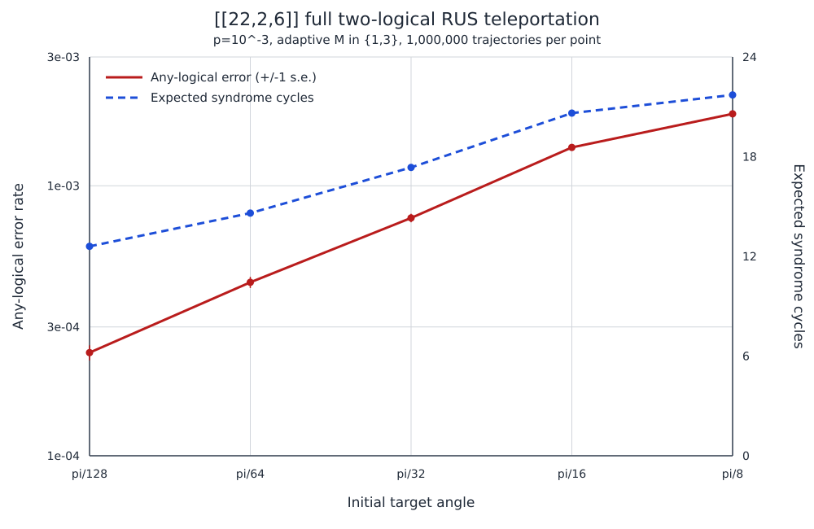

# `[[22,2,6]]` teleportation and RUS results

## Scope

These experiments reproduce the High-Rate STAR paper's teleportation-based
resource-state estimator and its stochastic RUS accounting for the saved
two-logical `[[22,2,6]]` code.  Unless explicitly marked ideal, the physical
depolarizing probability is

\[
p=10^{-3}
\]

on preparation, rotation, CNOT, idle, and measurement locations in the TMR
factory.  The operational calibration also places probability `p` after each
of the 22 transversal teleportation CNOTs and before terminal measurements.
Atom loss is not included.

## Validation

The exact joint decoder corrects all 2,146 Pauli patterns of symplectic weight
at most two.  At `theta=pi/32`, a 100,000-attempt zero-noise ClifT run measured

\[
s_{\rm prep}=0.46951\pm0.00158,
\]

consistent with the analytic two-logical value `0.4721745`.  Each Bell-sign
pattern occurred with probability within `0.0028` of `1/4`, and both logical
cancellation branches contained zero output errors.  An independent 2,000-shot
`tsim` run likewise found zero cancellation-branch errors.

## `theta=pi/32` baseline

The first 20-million-attempt experiment makes the Fig. 10 estimator tail
noise-free, isolating resource preparation.  The second applies the same
physical error probability to the transversal CNOT and terminal readout.

| Estimator | Preparation acceptance | Logical 0 infidelity | Logical 1 infidelity | Any error, both cancel |
|---|---:|---:|---:|---:|
| Noisy preparation, ideal estimator tail | `0.295107 +/- 0.000102` | `(7.15 +/- 0.49)e-5` | `(7.49 +/- 0.50)e-5` | `(1.382 +/- 0.097)e-4` |
| Noisy preparation and noisy teleportation tail | `0.295018 +/- 0.000102` | `(7.35 +/- 0.50)e-5` | `(7.59 +/- 0.51)e-5` | `(1.342 +/- 0.095)e-4` |

The difference is not statistically resolved because TMR errors dominate at
this angle.  A separate 20-million-attempt `theta=0` experiment with ideal
resource preparation isolates the teleportation Clifford/readout floor:

| Quantity | Estimate |
|---|---:|
| Logical 0 error | `(2.00 +/- 0.45)e-6` |
| Logical 1 error | `(2.20 +/- 0.47)e-6` |
| Any error, both cancel | `(2.40 +/- 0.69)e-6` |

Only 12 any-error events occurred in the joint cancellation sample, so this
floor estimate remains statistics limited.  Eleven of those events affected
both logicals, indicating a strongly correlated rare-error channel in this
terminal gadget that merits later fault-location analysis.

## Circuit-level RUS calibration

For small angles the calibration uses `M=3`; it switches to `M=1` above
`pi/8`, matching the paper's adaptive policy.  The displayed two-logical
infidelity is conditioned on both Bell signs selecting the cancellation
branch.  Full values and standard errors are in `CALIBRATION_P1E3.csv`.

| Angle | `M` | Acceptance, `N=1` | Acceptance, `N=2` | Infidelity, `N=1` | Any infidelity, `N=2` |
|---|---:|---:|---:|---:|---:|
| `pi/128` | 3 | `0.531810` | `0.457587` | `1.147e-5` | `2.448e-5` |
| `pi/64` | 3 | `0.487438` | `0.384401` | `3.037e-5` | `5.581e-5` |
| `pi/32` | 3 | `0.427118` | `0.295010` | `7.208e-5` | `1.390e-4` |
| `pi/16` | 3 | `0.351403` | `0.199784` | `1.866e-4` | `3.983e-4` |
| `pi/8` | 3 | `0.268233` | `0.116369` | `5.392e-4` | `1.189e-3` |
| `pi/4` | 1 | `0.524574` | `0.530800` | `4.888e-4` | `9.836e-4` |
| `pi/2` | 1 | `0.524577` | `0.530818` | `4.665e-4` | `9.809e-4` |

## Full two-logical RUS result

Each point below uses one million stochastic RUS trajectories.  Preparation
is retried blockwise until accepted, but after teleportation only logicals with
the wrong sign continue to the next doubled-angle level.  Reaching
`R_Z(pi)=Z` terminates through a Pauli-frame update.  No trajectory was
truncated.

| Initial angle | Mean accepted levels | Mean raw preparations | Mean syndrome cycles | Logical 0 error | Logical 1 error | Any-logical error |
|---|---:|---:|---:|---:|---:|---:|
| `pi/128` | `2.6371` | `6.3016` | `12.6032` | `1.32e-4` | `1.16e-4` | `(2.41 +/- 0.16)e-4` |
| `pi/64` | `2.6056` | `7.3016` | `14.6031` | `2.33e-4` | `2.10e-4` | `(4.39 +/- 0.21)e-4` |
| `pi/32` | `2.5428` | `8.6760` | `17.3520` | `3.91e-4` | `3.73e-4` | `(7.60 +/- 0.28)e-4` |
| `pi/16` | `2.4219` | `10.3108` | `20.6217` | `7.41e-4` | `6.55e-4` | `(1.387 +/- 0.037)e-3` |
| `pi/8` | `2.1874` | `10.8573` | `21.7147` | `9.01e-4` | `9.64e-4` | `(1.847 +/- 0.043)e-3` |

At `pi/32`, an accepted resource finishes both logical ladders immediately
with conditional probability approximately `1/4`.  Including preparation
post-selection, the raw first-round completion probability is

\[
0.073748.
\]

RUS removes the need to discard the other three sign patterns.  Both logicals
finish after an average of `2.5428` accepted levels and `8.6760` raw factory
attempts.  The corresponding `17.352` syndrome-cycle count assigns two
syndrome rounds to every raw preparation attempt, following the paper's cycle
accounting.

For comparison, two uncapped independent geometric ladders have

\[
\mathbb E[R_{\max}]=\frac{8}{3}=2.6667.
\]

The measured mean is smaller because the dyadic ladder terminates at the free
logical Pauli instead of extending indefinitely.  A through-origin fit to the
three smallest-angle any-error points gives the preliminary scaling

\[
\epsilon_{\rm any,RUS}\approx 8.1\,p\theta.
\]

This coefficient is specific to the current code, circuit, decoder, and
two-logical block metric.  It should not be identified with the bicycle-chain
paper's per-logical coefficient without a matched normalization and a wider
small-angle sweep.

## Decoder and modeling caveats

- The terminal decoder is exact minimum residual Pauli weight on every
  observed syndrome, not a Gurobi optimization over the complete circuit fault
  model.
- The stochastic RUS model applies the error-pattern distribution measured on
  the cancellation branch to wrong-sign branches as well.
- A one-active-logical level uses the logical-0 calibration even when logical
  1 is the survivor, relying on the code's order-two logical symmetry.
- The input reference patch is ideal.  Noise accumulated by an already-live
  Ising data block and error correction between algorithmic gates are outside
  this experiment.
- Loss and leakage are not yet included.
