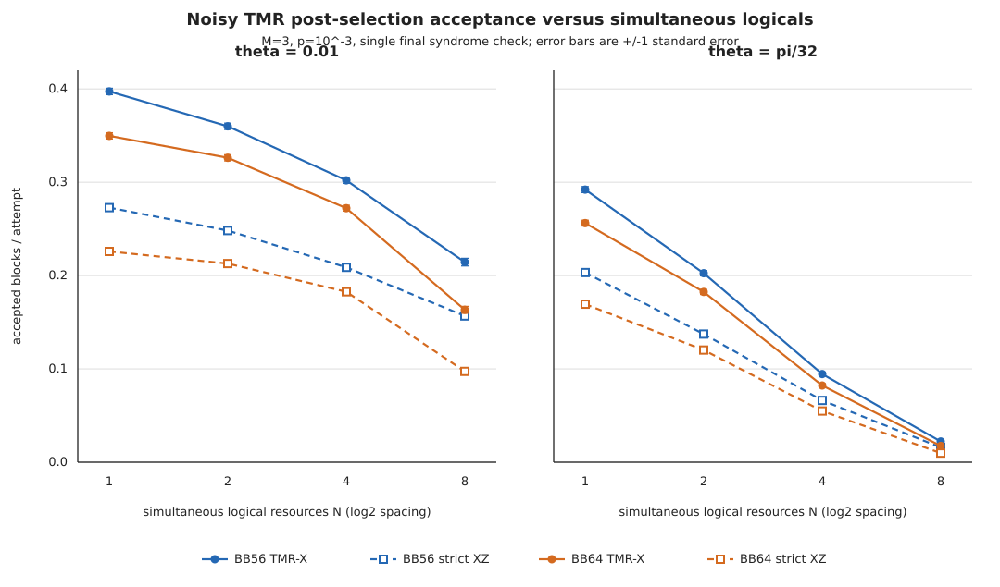

# BB56 versus BB64 acceptance as a function of N

All points are direct noisy ClifT measurements with `M=3`, `p=10^-3`, and the single-final-check protocol. The plot does not use extrapolated points. Error bars are one binomial standard error.

## theta = 0.01

| `N` | `BB56` TMR-X | `BB64` TMR-X | `BB56` strict XZ | `BB64` strict XZ |
|---:|---:|---:|---:|---:|
| 1 | 0.3973 +/- 0.00346015 | 0.3497 +/- 0.00337202 | 0.2728 +/- 0.00314945 | 0.22585 +/- 0.0029567 |
| 2 | 0.35995 +/- 0.00339401 | 0.3262 +/- 0.00331507 | 0.24825 +/- 0.00305468 | 0.21285 +/- 0.00289435 |
| 4 | 0.302 +/- 0.00324651 | 0.2722 +/- 0.00314728 | 0.2088 +/- 0.00287404 | 0.1826 +/- 0.00273182 |
| 8 | 0.2144 +/- 0.00410405 | 0.1633 +/- 0.00369639 | 0.1567 +/- 0.00363518 | 0.0973 +/- 0.00296366 |

## theta = pi/32

| `N` | `BB56` TMR-X | `BB64` TMR-X | `BB56` strict XZ | `BB64` strict XZ |
|---:|---:|---:|---:|---:|
| 1 | 0.2921 +/- 0.00321541 | 0.2562 +/- 0.00308676 | 0.2032 +/- 0.00284526 | 0.16935 +/- 0.00265208 |
| 2 | 0.2025 +/- 0.0028416 | 0.18245 +/- 0.00273095 | 0.1373 +/- 0.00243361 | 0.1202 +/- 0.00229948 |
| 4 | 0.09445 +/- 0.00206796 | 0.0822 +/- 0.0019422 | 0.0662 +/- 0.00175809 | 0.05485 +/- 0.00160999 |
| 8 | 0.0221667 +/- 0.000850006 | 0.0174 +/- 0.00130756 | 0.0158333 +/- 0.000720709 | 0.00978049 +/- 0.00048602 |

## Acceptance conventions

- `TMR-X` is the paper-matching TMR-sensitive projection rule.

- `strict XZ` additionally requires every raw Z-syndrome detector to be zero; it matches the original BB64 post-selection study.

The companion CSV records shot counts, standard errors, Wilson intervals, and source JSON paths for every plotted point.
